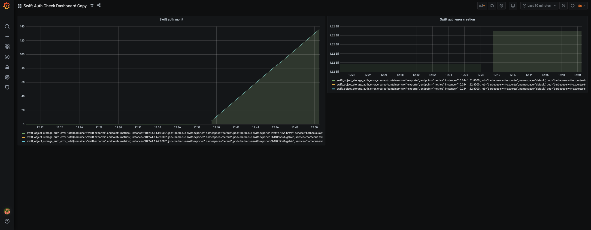

# :rotating_light: Swift Exporter

A Prometheus exporter for Swift Object Storage focusing on authentification monitoring, written in Python. Designed to be used within Kubernetes clusters, however it can also be used as a standalone exporter.




## Installation

### 🏃 TL; DR

The [Helm chart](https://github.com/enix/helm-charts/tree/master/charts/swift-exporter#-tldr) is the most straightforward way to get a fully-featured exporter running on your cluster.
The chart is also highly-customizable if you wish to. See the [chart documentation](https://github.com/enix/helm-charts/tree/master/charts/swift-exporter) to learn more.

The provided [Grafana Dashboard](https://grafana.com/grafana/dashboards/13922) can also be used to display the exporter's metrics on your Grafana instance.

### Using Docker

A docker image is available at [enix/swift-exporter](https://hub.docker.com/r/enix/swift-exporter).

### Using the pre-built binaries

Every [release](https://github.com/enix/swift-exporter/releases) comes with pre-built binaries for many supported platforms.

### Using the source

The project's entry point is `./src/swift-exporter`.
You can run it with Pipenv :

```bash
pipenv install
pipenv run python ./src/swift-exporter
```

## Usage

Only one metric is created but used with different labels :
* `swift_object_storage_auth_error`

Each new authentication error will create a new `type` label with the error's name.
e.g. : `swift_object_storage_auth_error_total {type="keystoneauth1_exceptions_http_unauthorized"}`

### Advanced usage

For advanced configuration, see the program's `--help` :

```
usage: swift_exporter.py [-h] [-r rate] [-t timout] [-c name] [-p port]

Prometheus probe for checking Swift Object Storage authentication liveness.

optional arguments:
  -h, --help            show this help message and exit
  -r rate, --rate rate  the ping rate in seconds
  -t timout, --timout timout
                        each request allowed time (in seconds) before timout error is raised
  -c name, --container name
                        the container's name you wan't to ping
  -p port, --port port  probe's port (default: 9790)
```
